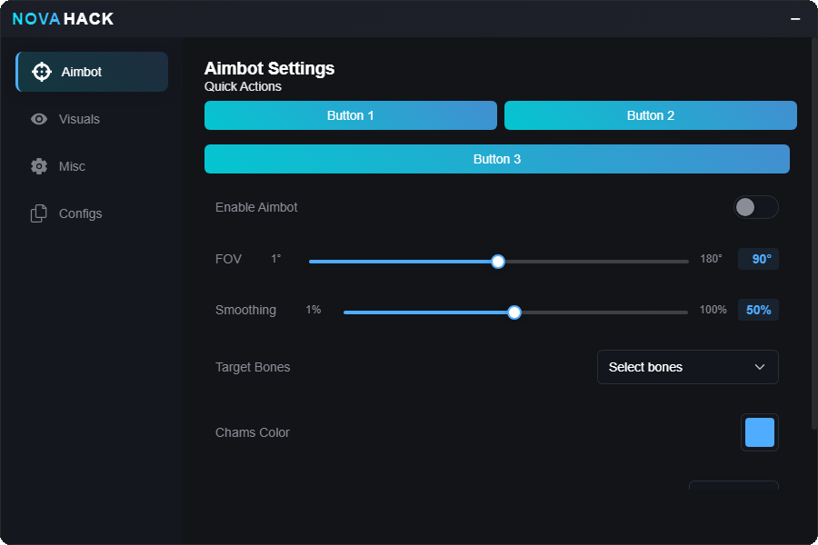

# NOVAHACK Menu

  
   
  A sleek, modern menu interface for game modifications with easy-to-use controls and configuration management.

## Features

### Controls
- **Insert Key**: Toggle menu visibility
- **Drag**: Click and drag the title bar to move the window
- **Minimize**: Click the − button to collapse the menu to a compact state

### Settings
- All settings are automatically saved
- Multiple configurations can be saved and loaded
- Real-time setting updates
- Visual feedback for all adjustments

### Design
- Clean, modern interface
- Blur effect background
- Smooth animations
- Responsive controls
- Color-coded feedback
- Tooltips for setting descriptions

### UI Kit
- **Button**: A clickable button component
- **Toggle**: A toggle switch component
- **Slider**: A slider component for numeric input
- **Dropdown**: A dropdown component for selecting options
- **ColorPicker**: A color picker component for selecting colors
- **Input**: A text input component
- **List**: A list component for displaying items
- **Section**: A section component for grouping related controls
- **Window**: A window component for displaying the main menu
- **Tab**: A tab component for switching between different sections
- **Tooltip**: A tooltip component for displaying information
- **ButtonRow**: A row component for displaying buttons in a row

## Installation

1. `git clone https://github.com/scar17off/novahack-ui`
2. `cd novahack-ui/script`
3. `npm install --save-dev`
4. `npm run build`
5. Open `novahack-ui.user.js` in your browser and click the `Install` button.
6. Profit.

## Contributing
All contributions are welcome! Please open an issue or a pull request.

## License
This project is licensed under the MIT License. See the [LICENSE.md](LICENSE.md) file for details.